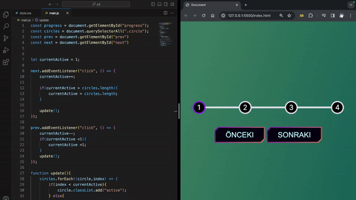

# Şık Butonlar ve Çok Adımlı İlerleme Göstergesi 🚀

HTML, CSS ve JavaScript kullanılarak oluşturulmuş, duyarlı ve görsel olarak çekici çok adımlı bir ilerleme göstergesi. Bu proje, kullanıcıları çok adımlı bir süreçte yönlendirmenin şık ve modern bir yolunu sunar.

## Özellikler

- **İlerleme Takibi**: Dinamik bir ilerleme çubuğu ve numaralandırılmış dairelerle ilerlemeyi açıkça görselleştirin.
- **Şık Butonlar**: Göze çarpan, hover ve focus olaylarına yanıt veren gradyan dolgulu butonlar ile kullanıcıları etkileşime sokun.
- **Duyarlı Tasarım**: Farklı ekran boyutlarında sorunsuz bir deneyim sağlar.
- **Devre Dışı Bırakılmış Durum**: Kullanıcı deneyimini artırmak için uygun olmayan durumlarda gezinme düğmelerini sezgisel olarak devre dışı bırakma.

## Kullanılan Teknolojiler

- **HTML**: İlerleme göstergesinin yapısını belirlemek için işaretleme dili.
- **CSS**: Gradyanlı butonlar ve canlı bir arka plan içeren stil sayfası.
- **JavaScript**: İleriye dönük ilerlemeyi dinamik olarak günceller ve düğme durumlarını yönetir.

## Kullanım

1. Repo'yu klonlayın: `git clone https://github.com/avcisalih/animate-next-prev-bar`
2. `index.html` dosyasını tercih ettiğiniz web tarayıcısında açın.

## Nasıl Özelleştirilir

- **Renkleri Değiştirin**: `style.css` dosyasındaki `--line-border-fill` ve `--line-border-empty` değişkenlerini istediğiniz renk şemasına uyarlayın.
- **Yazı Tipi Özelleştirmesi**: `style.css` dosyasındaki `@import` ifadesini tercih ettiğiniz Google Font'u içerecek şekilde güncelleyin.

Bu projeyi keşfedin ve ihtiyaçlarınıza uyacak şekilde uyarlayın. Herhangi bir sorunla karşılaşırsanız veya iyileştirmeler için önerileriniz varsa avcisalihoffical@gmail.com adresinden bana ulaşabilirsiniz !

İyi kodlamalar! 🌟

